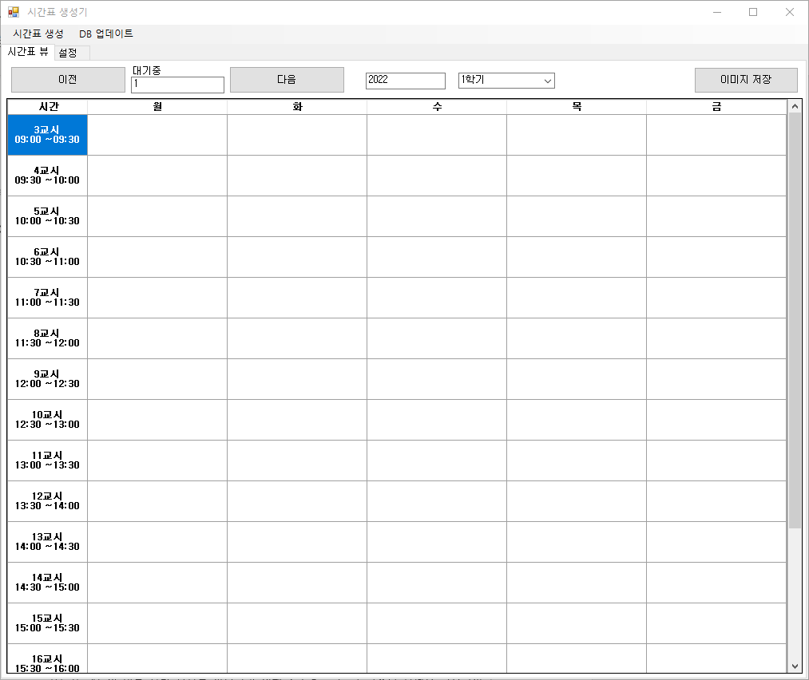
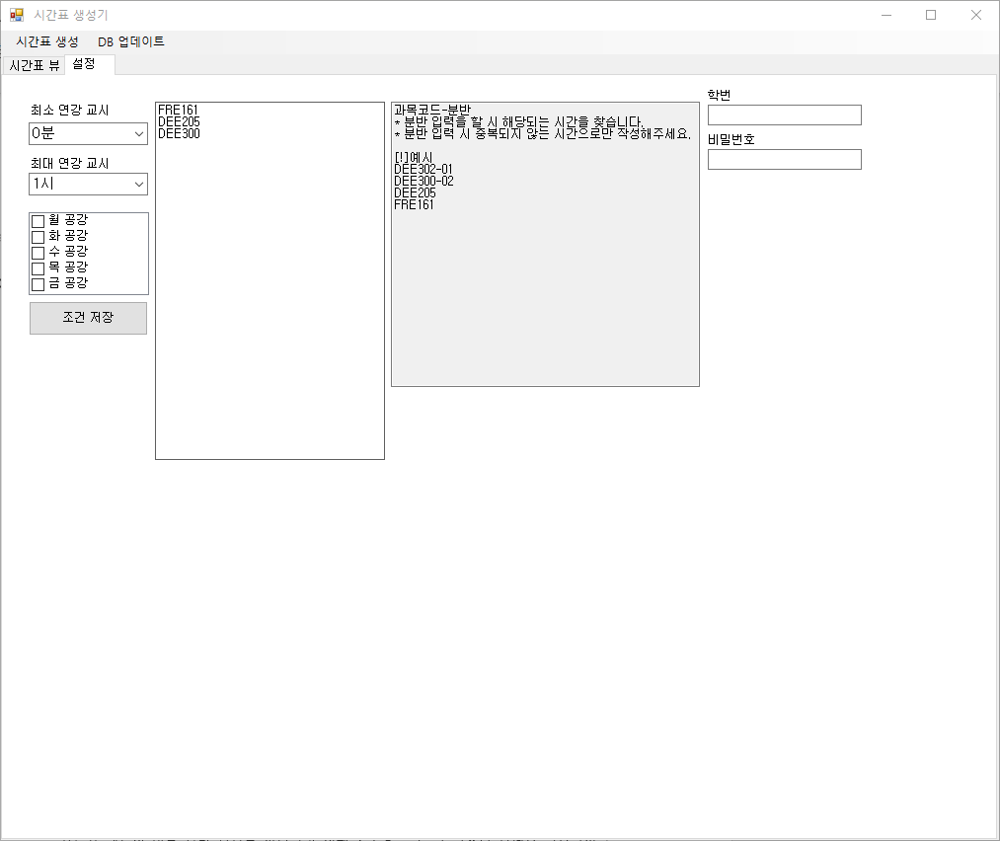

# TimeTableMaker
 시간표 생성기

스택: C#, SQLite, 크롤링  
기한: 2019.07  

프로젝트 설명:  
학교 수강신청 페이지를 웹 크롤링하여 SQLite에 저장을 합니다. 그리고 저장된 데이터과 사용자가 지정한 조건 (과목명 혹은 과목명-분반)과 공강 정보를 입력하면 조합할 수 있는 시간표들을 확인 할 수 있습니다.

스크린샷:

